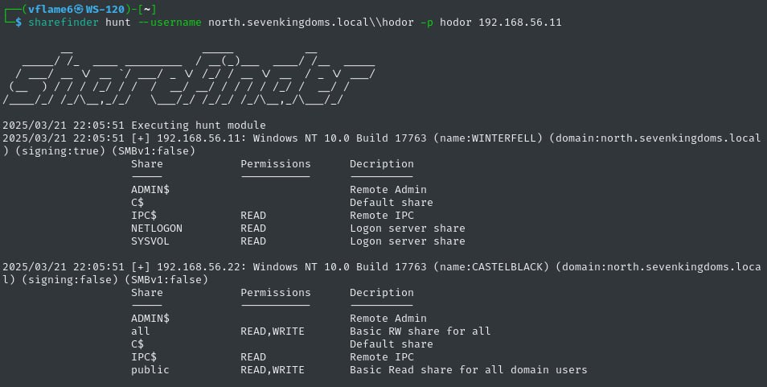

<h1 align="center">
  sharefinder
</h1>

<h4 align="center">Active network shares enumeration tool.</h4>

<p align="center">
<a href="https://goreportcard.com/report/github.com/vflame6/sharefinder" target="_blank"></a>
<a href="https://github.com/vflame6/sharefinder/issues"></a>
<a href="https://github.com/vflame6/sharefinder/releases"></a>
</p>

---

`sharefinder` is a network share discovery tool that enumerates shares, permissions and files in networks and domains.

# Features



Main commands:

- `hunt`: hunt network shares inside Active Directory domain
- `auth`: scan network for shares with specified credentials
- `anon`: search for shares accessible by anonymous/guest account

# Usage

```shell
sharefinder -h
```

Here is the help menu for the tool.

```yaml
usage: sharefinder [<flags>] <command> [<args> ...]

  sharefinder is a network share discovery tool that enumerates shares, permissions and files in networks and domains.

Flags:
  -h, --[no-]help      Show context-sensitive help (also try --help-long and --help-man).
  --[no-]debug     Enable debug mode, print debug messages
  --[no-]quiet     Enable quiet mode, print only results
  -o, --output=""      Filename to write output in raw format
  --output-xml=""  Filename to write XML formatted output
  --output-all=""  Filename to write output in all formats
  --[no-]html      Generate HTML report (requires XML output)
  --threads=1      Number of threads
  --timeout=5s     Seconds to wait for connection
  --smb-port=445   Target port of SMB service
  --proxy=""       SOCKS-proxy address to use for connection in format IP:PORT
  -e, --exclude="IPC$,NETLOGON,ADMIN$,print$,C$"
  Exclude list
  --[no-]list      List readable shares
  --[no-]recurse   List readable shares recursively
  --[no-]version   Show application version.

Commands:
  help [<command>...]
  anon <target>
  auth --username=USERNAME [<flags>] <target>
  hunt --username=USERNAME [<flags>] <dc>
```

# Installation

`sharefinder` requires **go1.24** to install successfully.

```shell
go install -v github.com/vflame6/sharefinder@latest
```
